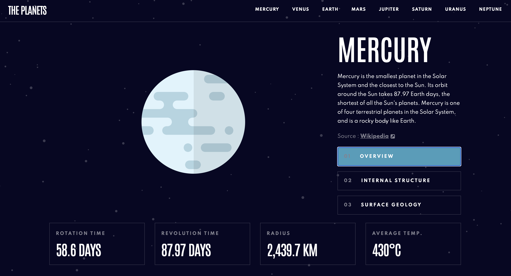

# Planets fact site

React-based planets fact site that features a dynamic experience.

## Built With

- JavaScript
- React.js
- HTML5
- CSS3

## Live Demo

[Live Demo Link](https://planets-fact-site-project.netlify.app/)

## Getting Started

To get a local copy up and running follow these simple example steps.

### Prerequisites

* You need npm to be installed on your local machine. For details please use the following site: 
https://docs.npmjs.com/downloading-and-installing-node-js-and-npm

### Setup

* Next you need to clone the repository on your local machine with the following command line:
git clone https://github.com/vericamitreva/planets-fact-site.git

### Install

* To install the project you need to enter the directory you've cloned. Open a terminal and follow these next steps:
* npm install (to install all the necessary modules and dependencies)

### Usage

* To run this project localy simply run the following line:

npm start;

* And the project should be deployed on your machine and you can access it on a browser by default on the URL: localhost:3000

## Author

- Verica Mitreva

👤 **Author**

- GitHub: [@githubhandle](https://github.com/vericamitreva)
- LinkedIn: [LinkedIn](https://www.linkedin.com/in/vericamitreva)

## 🤝 Contributing

Contributions, issues, and feature requests are welcome!

Feel free to check the [issues page](issues/).

## Show your support

Give a ⭐️ if you like this project!